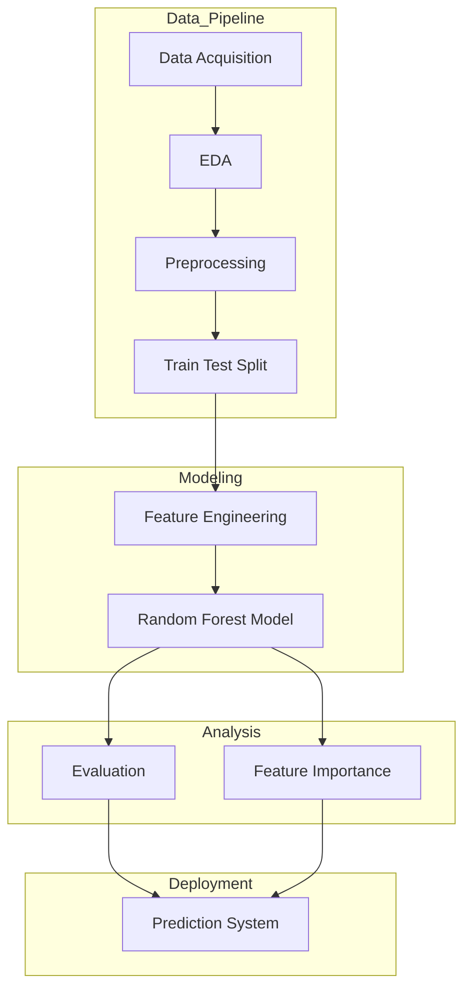

```mermaid
flowchart TD

subgraph Data_Pipeline
    A[Data Acquisition]
    B[EDA]
    C[Preprocessing]
    D[Train Test Split]
    A --> B --> C --> D
end

subgraph Modeling
    E[Feature Engineering]
    F[Random Forest Model]
    D --> E --> F
end

subgraph Analysis
    G[Evaluation]
    H[Feature Importance]
    F --> G
    F --> H
end

subgraph Deployment
    I[Prediction System]
end

G --> I
H --> I
```
